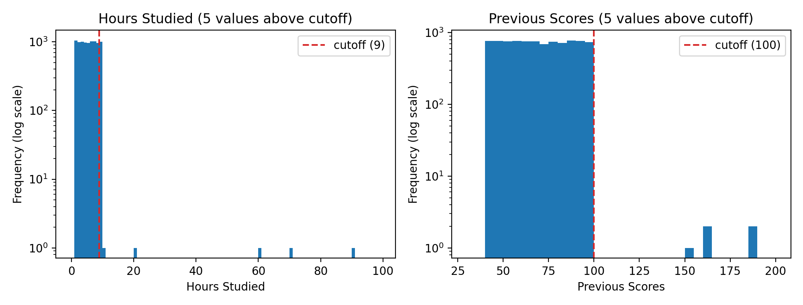
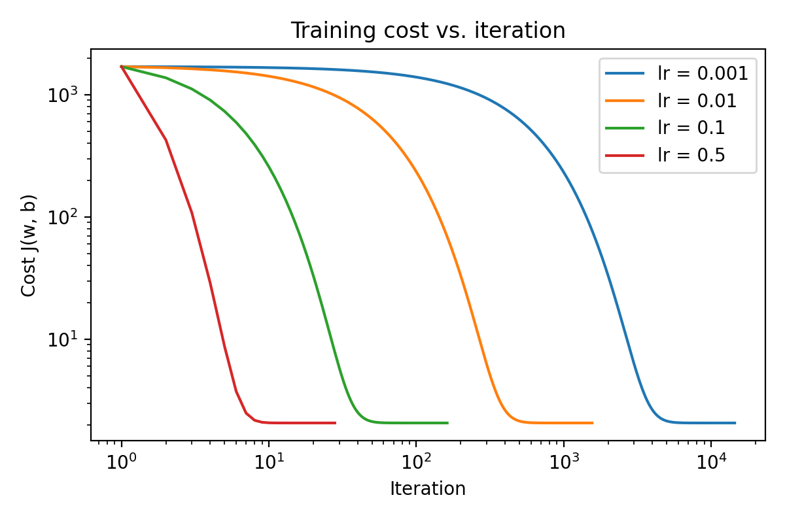
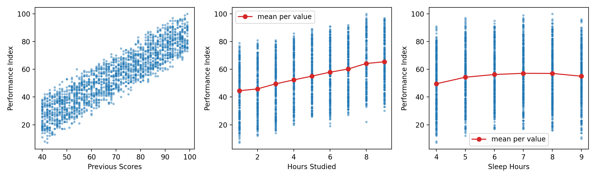
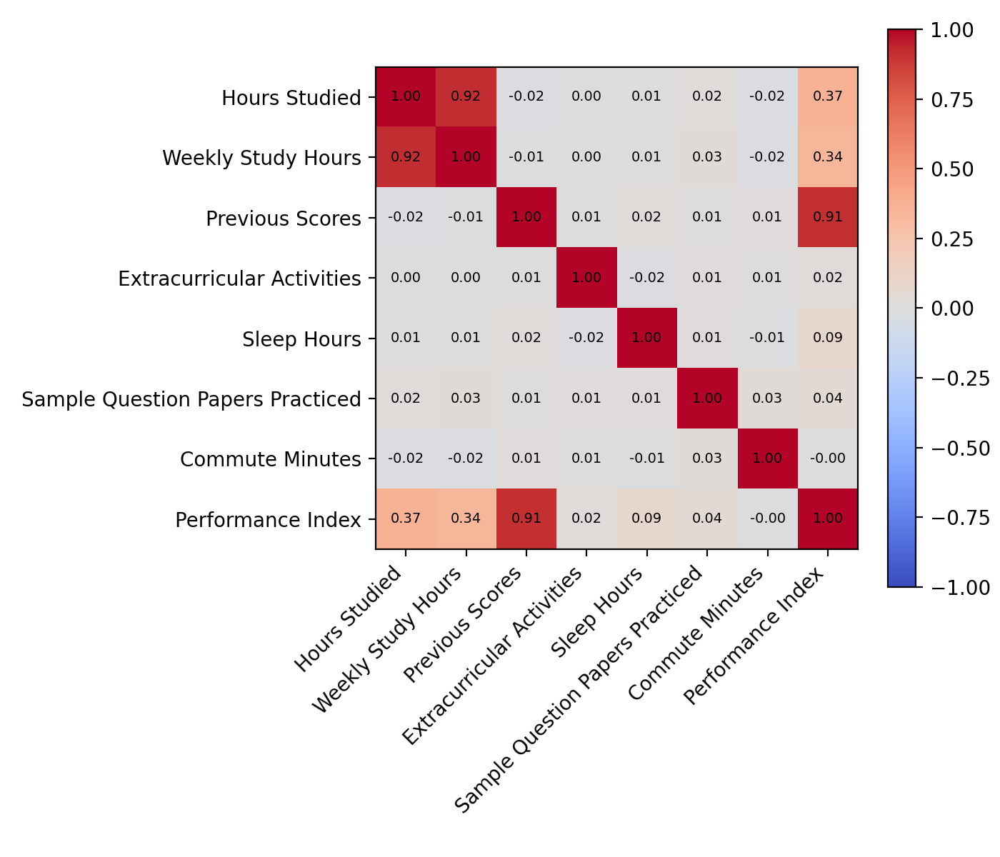

# Predicting Student Performance for AISD

Noah Sizemore — TAMUSA Machine Learning, Midterm Project

This is a repository housing my midterm assessment for the TAMUSA Machine Learning class.

## Overview

Assume I am working as a data scientist for the AlamoGreat Independent School District (AISD). AISD is adopting a data-driven approach to improving student performance and has two goals. First, it wants a model that predicts each student's performance, so that staff can reach out early to students who may need help. Second, it wants to know which factors are most closely associated with a student's overall performance.

In this project, I  will predict each student's Performance Index from study habits and prior scores, then identify the three most important features. The project has three parts, covering data preparation, a from-scratch implementation of linear regression with gradient descent, and a computational analysis of feature importance.

By the end of this project, you will be able to do the following.

- Derive and implement gradient descent for a multi-feature linear model.
- Clean messy data and build a reproducible, leak-free pipeline.
- Predict students' Performance Index on a held-out test set.
- Measure feature importance computationally and support a claim with more than one kind of evidence.

## 1. Introduction

AISD wants (1) a model that predicts each student's Performance Index early enough to target help, and (2) to know which factors are most closely associated with performance.
I built a multi-feature linear regression trained by gradient descent (NumPy only) on the student data.

- Final validation MSE / RMSE: **4.28 / 2.07** (Table 4)
- Top three features: **Previous Scores, Hours Studied, Sleep Hours** (Table 6)

The cleaning consists of actaully cleaning the table's missing values through median values as well as dropping rows with missing or errors values. This allowed for the best results when evaluating the table. The feature-importance was determined by multiple ranking methods, each handling different aspects.

## 2. Data Handling

### 2.1 Exploration

**Table 1.** Summary statistics of `train` (8,999 rows). Source: `code/results/summary_stats.md`.

| Column | Min | Max | Mean | Missing | Entry errors |
|---|---|---|---|---|---|
| Hours Studied | 1 | 90 | 5.00 | 0 | 5 |
| Weekly Study Hours | 0 | 88 | 34.92 | 360 | 0 |
| Previous Scores | 40 | 188 | 69.44 | 0 | 5 |
| Extracurricular Activities | 0 | 1 | 0.50 | 0 | 0 |
| Sleep Hours | -9 | 9 | 6.52 | 360 | 5 |
| Sample Question Papers Practiced | 0 | 9 | 4.56 | 360 | 0 |
| Commute Minutes | 5 | 120 | 29.95 | 0 | 0 |
| Performance Index | 7 | 100 | 54.97 | 0 | 0 |

The following already have errors: 
* Hours Studied: a max of 90 against a mean of 5.0 is not possible as a daily figure, and the range 1–9 holds for almost every row.
* Previous Scores: 188 is above the 0–100 scale.
* Sleep Hours: −9 is a negative duration.

### 2.2 Missing values

- Method: Most rows with missing are uncomputable values have been removed, with remaining rows that can be assumed use the median value.
- Affected: 360 cells each in Weekly Study Hours, Sleep Hours and Sample Question Papers Practiced (1,080 cells), plus 15 entry-error cells turned into NaN: 1,095 missing cells in total.
- Result: 723 rows removed, **8,276 kept** (of 8,999).
- Why: Imputing values gave a decent RMSE of 2.31l however, removing rows improve the score even further to 2.04. Medians are robust outliers, meaning removing them improves the RMSE score.

### 2.3 Data-entry errors

- Detection: rule per column (`ENTRY_RULES` in `linear_gd.py`) — impossible ranges (score outside 0–100, sleep < 0 or > 24, hours > 168/week) and a histogram check for Hours Studied (8,994 of 8,999 values in 1–9).
- **Table 2.** Errors found per column

| Column | Rule | Count | Values |
|---|---|---|---|
| Hours Studied | outside 0–9 | 5 | 10, 20, 60, 70, 90 |
| Previous Scores | outside 0–100 | 5 | 154 … 188 |
| Sleep Hours | < 0 or > 24 | 5 | -9, -7, -6, -4, -4 |
| all other columns | see code | 0 | |

- Handling: replaced with NaN, then the rows are dropped with the missing-value step (Section 2.2).
- Why: The values are unknown, so dropping these rows does not affect the table as a whole. Imputing the values where able gives more training data. 

### 2.4 Scaling

- Method: standardization, z = (x − mean) / std, applied to every model input column.
- Why: The feature range is quite leage, some itesm 0-9 and other up to 100, so standardizing the results allows for one learning rate to apply for all features. 
- Statement: the mean and std were computed **from the training data only** and reused for the validation and test data (`Preprocessor.fit` / `.transform`).

### 2.5 Pipeline

1. Replace entry errors with NaN.
2. Training only: drop rows missing the target or a core feature.
3. Split into training and validation (Section 3.2).
4. Fit on the training split: medians, the Sleep Hours centre, and the standardization mean/std.
5. Impute any remaining NaN with the training medians.
6. Add `Sleep Hours Sq = (Sleep Hours − training mean)²`.
7. Standardize.

The same fitted `Preprocessor` transforms `test_features`. For the final model it is refit on all cleaned training rows, then applied to the test features.

## 3. Model Development

### 3.1 Implementation

Model: ŷᵢ = wᵀxᵢ + b, with m training rows and n features.

Cost: J(w, b) = 1/(2m) · Σᵢ (ŷᵢ − yᵢ)²

Gradients: ∂J/∂w = (1/m) · Xᵀ(ŷ − y), ∂J/∂b = (1/m) · Σᵢ (ŷᵢ − yᵢ)

Update: w ← w − α · ∂J/∂w, b ← b − α · ∂J/∂b

Stopping rule: stop when |J(t−1) − J(t)| < tol (tol = 1e-12) or after max_iter = 20,000 iterations. The cost is recorded at every iteration.

Check: the fitted parameters differ from the closed-form least-squares solution (`numpy.linalg.lstsq`) by at most **4.1e-7**.

### 3.2 Validation design

80 % / 20 % random split of the cleaned training rows: 6,621 training and 1,655 validation rows, seed **42**.

### 3.3 Training behavior

**Table 3.** Learning-rate comparison (feature set D)

| Learning rate | Iterations to convergence | Val RMSE |
|---|---|---|
| 0.001 | 14,459 | 2.0685 |
| 0.01 | 1,557 | 2.0685 |
| 0.1 | 162 | 2.0685 |
| 0.5 | 28 | 2.0685 |

Chosen: **0.5** (fastest to converge, same final error). The trade-off is simple: the smaller the rate, the slower the training is, while the larger it is, the faster and more likely it is to diverge. 

### 3.4 Model selection

**Table 4.** Experiments (learning rate 0.1; validation split above)

| Experiment | Features | Val MSE | Val RMSE |
|---|---|---|---|
| A: Previous Scores only | 1 | 65.56 | 8.10 |
| B: A + Hours Studied | 2 | 11.36 | 3.37 |
| C: 5 core features | 5 | 8.38 | 2.89 |
| **D: C + Sleep Hours Sq** | 6 | **4.28** | **2.07** |
| E: D + Weekly Study Hours | 7 | 4.28 | 2.07 |
| F: D + Commute Minutes | 7 | 4.29 | 2.07 |
| G: all 7 + Sleep Hours Sq | 8 | 4.29 | 2.07 |

Engineered feature: Sleep Hours Sq. The mean Performance Index rises from around 50 ar four hours of sleep to around 57 with seven to eight hours of sleep, then falls at nine hours. This means a straight line fits poorly to this. Adding the squared term, it was able to reduce RMSE from 2.89 to 2.07. Adding Weekly Study Hours and Commute Minutes did not affect the scores in any way (Weekly Study Hours duplicates Hours Studied, r = 0.92).

### 3.5 Final model

- Features: Hours Studied, Previous Scores, Extracurricular Activities, Sleep Hours, Sample Question Papers Practiced, Sleep Hours Sq.
- Learning rate 0.5, tol 1e-12, max_iter 20,000; converged in 28 iterations.
- Retrained on the full cleaned training file (8,276 rows, preprocessing refit) before predicting the test set.
- **Final validation RMSE: 2.07** (from the train-only model).

## 4. Feature Importance

### 4.1 Methods

1. Permutation importance — shuffle one feature in the validation set (20 repeats) and measure the RMSE increase.
2. Drop-one retraining — retrain without the feature and measure the validation RMSE increase.
3. Single-feature models — train on one feature alone; score = RMSE below the predict-the-mean baseline.
4. Standardized coefficients — |w| on standardized features.
5. Random-forest importance — `feature_importances_` (scikit-learn, 200 trees).

Note: Sleep Hours and its squared term are treated as one feature in methods 1–4. The analysis uses all seven raw features.

### 4.2 Results

**Table 5.** Importance scores by method (seed 42). Source: `code/results/importance_scores.md`.

| Feature | Permutation | Drop-one | Single-feature | Std. coef. | Random forest | Mean rank |
|---|---|---|---|---|---|---|
| Previous Scores | 22.83 | 15.55 | 10.94 | 17.68 | 0.840 | 1.0 |
| Hours Studied | 8.61 | 1.85 | 1.23 | 7.40 | 0.141 | 2.0 |
| Sleep Hours | 2.09 | 1.22 | 0.16 | 3.41 | 0.014 | 3.2 |
| Sample Question Papers Practiced | 0.15 | 0.08 | -0.01 | 0.55 | 0.002 | 4.8 |
| Weekly Study Hours | 0.00 | 0.00 | 0.95 | 0.02 | 0.002 | 5.2 |
| Extracurricular Activities | 0.05 | 0.03 | 0.01 | 0.31 | 0.000 | 5.4 |
| Commute Minutes | -0.00 | -0.00 | -0.00 | 0.06 | 0.001 | 6.4 |

**Table 6.** Ranked top three (mean rank across the five methods): **1. Previous Scores, 2. Hours Studied, 3. Sleep Hours**.

### 4.3 Comparison

Four of five methods give the same top three. The exception is the single-feature method, which puts Weekly Study Hours third.
Weekly Study Hours correlates to Hours Studied, producing the same values of 0.92, so it by itself would produce the same prediction. Once Hours Studied is intorduced into the model, it holds almost no value. Sleep Hours scores low as a single feature because its effect is small on its own; it matters in combination with the others.

### 4.4 Stability

**Table 7.** Top three for five random splits (seeds 1–5). Source: `code/results/importance_stability.md`.

Previous Scores > Hours Studied > Sleep Hours for the permutation, drop-one, std.-coefficient, random-forest and mean-rank methods in **all five splits**. The single-feature method gave Weekly Study Hours as third in all five. From this, it is proven that the rankings are stable, as they are the same across all five splits.

### 4.5 Relationships

- Figure 3: Previous Scores is strongly linear (r = 0.91); Hours Studied rises steadily (r = 0.37); Sleep Hours is curved, flat between 6 and 8 hours.
- Correlated features: only Hours Studied and Weekly Study Hours are strongly correlated (r = 0.92). Permutation and drop-one understate each of the pair (the other covers for it), single-feature models credit both, coefficients split the weight between them, random forests share importance between them.

### 4.6 Prediction vs. causation

The results show that these features help predict Performance Index, not that changing them would change a student's score. The data is observational, meaning there may be cofounders. One example could be how motivation would affect both the study hours as well as the scores. Another options could bne previous scores being a proxy for ability, as they may affect motivation or intuition. What the data can actual support could be the following: flagging students who are at risk or are struggling. The data shows directly that more sleep and study would impriove a students scores.

## 5. Conclusion

To conclude the study, the single most important aspect of the sata is the prior scores mixed with the study hours and sleep. These together give actual correlation meaning to the data. Others, such as extracurriculars and commute, add little to the scores, holding less meaning. The biggest limitations of the model is its use of oberservational data, removing outliers and NaN values, and using a linear model instead of non-linear.

## References

- Liang, Tony (2026). mid-term_exam.pdf [PDF file]. BlackBoard. Texas A&M Univeristy - San Antonio
- Harris, C. R., Millman, K. J., van der Walt, S. J., et al. (2020). Array Programming with NumPy. Nature 585, 357 (2020). https://doi.org/10.1038/s41586-020-2649-2
Cited by: 37133
McKinney, W. (2010). Data Structures for Statistical Computing in Python. Proceedings of the Python in Science Conference, 56-61. https://doi.org/10.25080/majora-92bf1922-00a
Cited by: 18192
- Anthropic. (2026, September 30). Clean and explain code with Python [explain concepts, debug errors, suggest the Sleep Hours squared feature, and create skeleton for report]. Claude Code (Sonnet 5.5 Medium)
